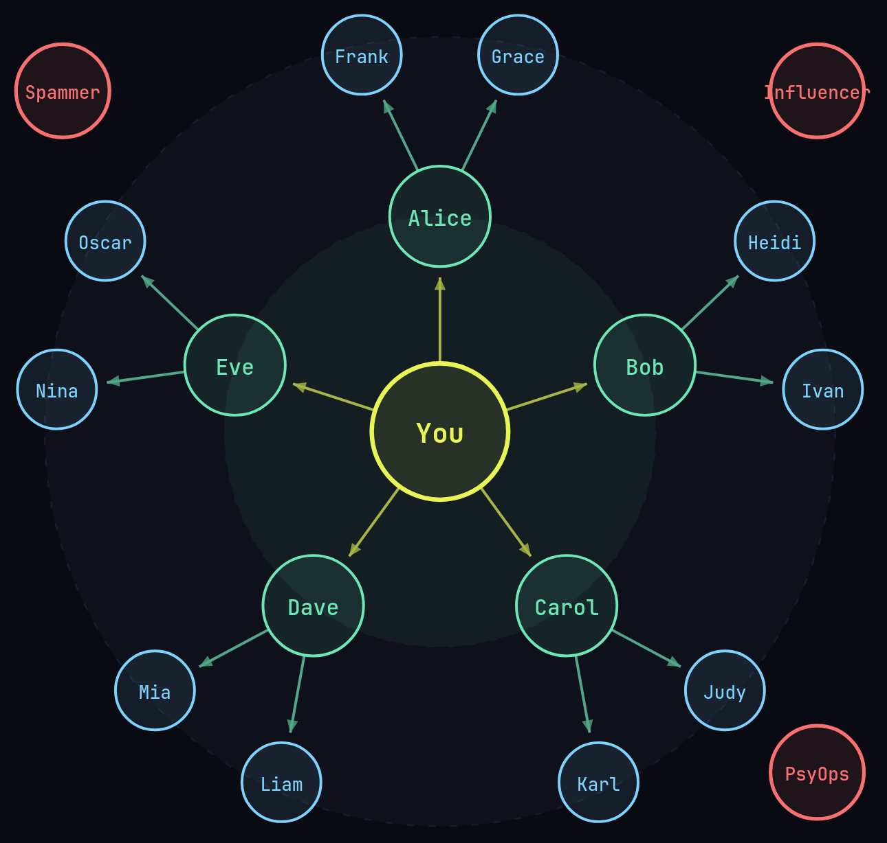
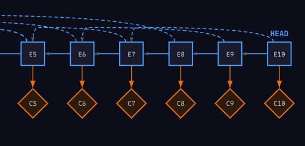

Rostra
====

<!-- list_item_newlines: 2 -->
<!-- incremental_lists: true -->

* P2P/F2F social network protocol
* Implementation in Rust
* [Public instance available](https://rostra.me)
* Self-hostable
* Can run from any device.

<!-- end_slide -->

Rostra: Big Problems with Social Networks
====

<!-- list_item_newlines: 1 -->
<!-- incremental_lists: true -->

* global public square
  * not how we interact with people and groups
  * even public squares were not supposed to be so large
  * irrelevance vs shouting match with the whole Internet
  * little respect for connections
* attention economy
  * good only for influencers and self-promoters
  * bots, spam, low quality content
  * wrong discoverability defaults
  * catchy and controversial content spreads like wildfire
* moderation

<!-- pause -->

All neatly solved by a F2F model.

<!-- end_slide -->

Rostra: Friend-to-friend
====

<!-- column_layout: [3, 3] -->

<!-- column: 1 -->

<!-- column: 0 -->
<!-- list_item_newlines: 1 -->

How it works:

* you follow people you find interesting
  * just like any other social network
* you see people you follow and people they follow

Benefits:

* moderation not an issue without censorship (!)
* mimics how human communities work
* organic discoverability
* right incentives
* quality over quantity
* more like RSS between friends than Twitter
* wide visibility and reach still possible

<!-- end_slide -->

Rostra: Personas
====

<!-- list_item_newlines: 1 -->
<!-- incremental_lists: true -->

Problem:

* You're passionate about software and music.
* I love your software, but hate your music.
  * Should I still follow you?
  * Should you stop posting music?
  * Alice loves your music.
* Do you maintain two accounts?

Solution:

* Posts associated with your "Persona"
* Followers can opt-in or opt-out from some.
* Simple way to remain "wholesome".

Still requires some UX research and work.

<!-- end_slide -->

Rostra: Under the hood - Overview
====

<!-- list_item_newlines: 2 -->
<!-- incremental_lists: true -->

* Public
* Self-sovereign via cryptographic ids
  * [Pkarr](https://pubky.github.io/pkarr/) for bootstrapping connectivity
* P2P via [Iroh](https://iroh.network)
  * private connectivity mode by default
  * Tor transport in the future
* Events - a bit like CRDS - replicated between users

<!-- end_slide -->

Rostra: Under the hood - Events
====

<!-- column_layout: [3, 3] -->

<!-- column: 1 -->

<!-- column: 0 -->
<!-- list_item_newlines: 1 -->

* Events DAG: Simple but flexible data model.
* Signed, small fixed size (192B signed), id = hash.
* Vers, Flags, Timestamp, Author, Kind and Aux-key
* Parent + aux parent
  * DAG - very useful properties
  * Easy multi-device support (improvement over SSB)
* Detached content
  * Can be fetched and pruned separately, potentially on demand.
  * Events commit to content via hash + len
    * BAO verified streaming

<!-- end_slide -->

Rostra: WebUI
====

* Simple but functional built-in SSR UI
* Hypermedia, functional without JS
* Responsive, mobile-friendly
* Can run anywhere
 * Local app
 * Hosted instance: public or private
* Features:
  * Social Post
  * Djot (Markdown) formatting
  * Native or External Media (videos & large attachements!)
  * Emojis, LaTeX Math, Syntax Highlightning
  * Notifications, Mentions
  * Shoutbox
  * RSS feeds

<!-- end_slide -->

The End
====

Thanks you for your time!

You can easily try out Rostra using [Rostra's public demo instance](https://rostra.me).

Please share your feedback on [Rostra's Github Discussions page](https://github.com/dpc/rostra/discussions), or [dpc's #support Matrix channel](https://matrix.to/#/#support:dpc.pw).
